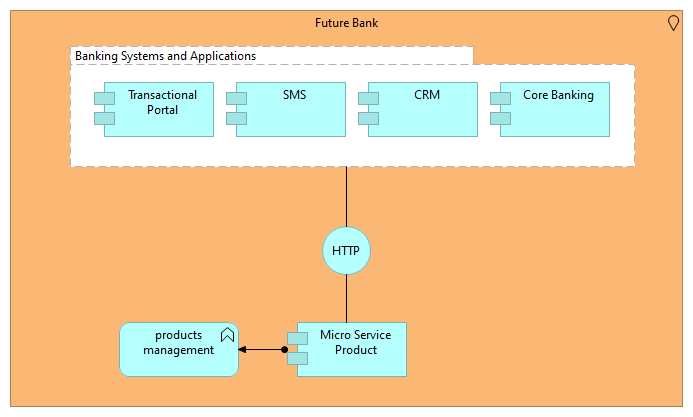
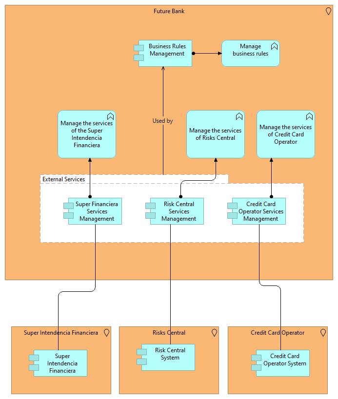
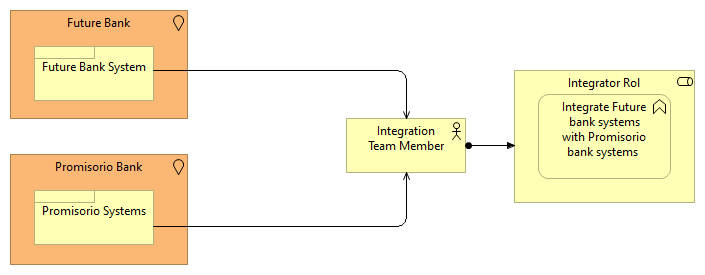
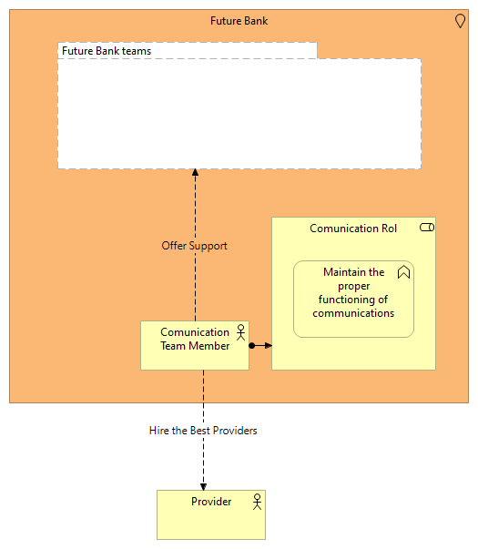
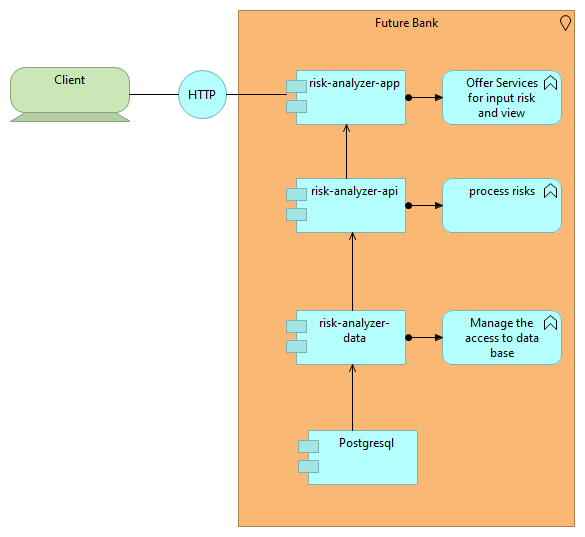
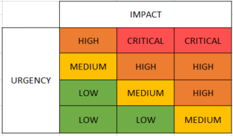

## Descripción
Este Proyecto ofrece diferentes soluciones al Banco Futuro, intentando responder a sus necesidades actuales tales como:
1. Creación de nuevos productos y mantenimiento de los actuales.
2. Falta de flexibilidad en los cambios de la regla de negocio.
3. Integración con el Banco Promisorio
4. Fallos de comunicación entre los diferentes equipos
5. Creación de un sistema para el manejo de los riesgos

## Direccionadores
Se seleccionaron los siguientes direccionadores:
1. Alta demanda de integración con sistemas de entidades externas.
2. Arquitectura de aplicaciones no especificada bajo una arquitectura empresarial
3. Aumentar el nivel de servicios electrónicos del banco con respecto a las exi-gencias
mercado
4. Inconformidad de los clientes que hacen uso de los servicios

## Arquitectura
En cada una de las necesidades del banco se expone un diagrama diseñado en Archimate para dar una solución.


### Creación de Nuevos Productos y Mantenimiento de los Actuales
Para esta necesidad se propone centrar la gestión de productos en un componente que ofrece los servicios para los demás componentes, sistemas y/o aplicaciones.



### Falta de Flexibilidad en los Cambios de la Regla de Negocio
En este caso se propone el desarrollo de diferentes componentes para la gestión con entidades externas tales como:
- Super Intendencia Financiera
- Central de Riesgo
- Servicios de Operadores de Tarjetas de Credito



### Integración con el Banco Promisorio
Para la integración con la nueva adquisición que es el Banco Promisorio se propone la creación de un equipo, el cual se enfocara en todo lo necesario para una integración conmpleta y confiable, este equipo tendrá la función de integrar los aplicativos y/o sistemas del nuevo banco y el Banco Futuro.




### Fallos de Comunicación entre los Diferentes Equipos
Para resolver los inconvenientes de comunicación se propone la creación de un equipo de comunicaciones cuyo rol será la gestión referente a los proveedores y ofrecer soluciones a los equipos del banco a través del sopore y mejoras.



### Creación de un Sistema para el Manejo de los Riesgos
El sistema creado está conformado por un componente que ofrece 2 recursos:
1. Crear o actualizar un riesgo
2. Obtener la matriz de riesgo
En el siguiente diagrama se muestra la estructura de la aplicación desarrollada:


#### risk-analyzer-app
Este componente ofrece los servicios y/o recursos para la gestión de riesgos y son los siguientes:
1. Creación y/o Actualización de riesgo
- **Path**: http://[HOST]:[PORT]/risk-analyzer/v1/
-  **Method**: PUT
- **Body**:
```json
{
	"risk": "[Nombre del riesgo a crear o Actualizar]",
	"impact":"[un número entre 1 y 3]",
	"urgency":"[un número entre 1 y 4]"
}
```
- **Result**: Http status 200
- **Example**: 
    - *Path*: http://localhost:8080/risk-analyzer/v1/
    - *Method*: PUT
    - *Body*: 
 ```json
 {
  "risk":"Risk test",
  "impact":1,
  "urgency":4
 }
 ```

2.  Obtener la Matriz de Riesgo
- **Path**: http://[HOST]:[PORT]/risk-analyzer/v1/
-  **Method**: GET
-  **Result**: Listado de riesgos con los valores después de ser calculados 
-  **Example**: 
    - *Path*: http://localhost:8080/risk-analyzer/v1/
    - *Method*: GET
    - *Result*: 
 ```json
 [
   {
     "risk": "Risk 1",
     "value": "HIGH"
   },
   {
     "risk": "Risk 2",
     "value": "LOW"
   }
 ]
 ```

#### risk-analyzer-api
Encargado de calcular el valor de un riesgo dato su urgencia e impacto, para eso se utiliza el siguiente modelo teniendo en cuenta que la urgencia tiene 4 variables y el impacto tiene 3 variables:



#### risk-analyzer-data
Este componente gestiona el acceso a base de datos. 
La base de datos creada para este ejercicio fue creada en [Heroku]. En *risk-analyzer\risk-analyzer-app\src\main\resources\config\application.yml* encontrará el acceso a la base de datos


#### Install

##### Prerequesites
To run the project you need the followings:
1. [Java]
2. [Spring-Boot]

[Java]: <https://www.java.com/es/download/>
[Spring-Boot]: <https://spring.io/projects/spring-boot>
[Heroku]: <https://www.heroku.com/>

##### Clone repository
```bash
$ git clone git@github.com:enriquealcocerappgate/risk-analyzer.git
$ cd risk-analyzer
```


##### Maven Project Commands

1. __Build the Project Without Test__

    ```
    mvn clean package -Dmaven.test.skip=true
    ```
    profile could be: _dev, int, prod, docker_

2. __Build the Project With Test Execution__

    ```
    mvn clean package
    ```
    profile could be: _dev, int, prod, docker_

3. __Run the Project Unit-Test__

    ```
    mvn test
    ```


4. __Run the Project (Development)__

    _From Parent Project_
    ```
    mvn -pl risk-analyzer-app
    ```
    _or_
    ```
    mvn spring-boot:run -pl risk-analyzer-app
    ```

    _From Spring app project directory_
    ```
    cd risk-analyzer
    risk-analyzer$ mvn
    ```
    _or_
    ```
    cd risk-analyzer
    risk-analyzer$ mvn spring-boot:run
    ```


##### Start Application in Intellij Develop Environment

Do right click in file risk-analyzer\risk-analyzer-app\src\main\java\net\appgate\risk\analyzer\app\Application.java and select the option _Run 'Application'_ or _Debug 'Application'_.

## Cuestionamientos
- **¿Defina porque utilizó (el lenguaje de programación, plataforma y Framework) o el
equipo de trabajo, según aplique?**
    - R/ Se utilizó Java con Spring Boot y postgresql. No se utilizo kafka por considerar que es un Over kill para el problema propuesto y no se utilizo dynamoDB, ya que es una base de datos para el acceso rápido  a items individuales, en este caso ser requeria extraer multiples items ( riesgos) para la mostrar los resultados, lo cual representa un alto costo para DynamoDB.
- **¿Como priorizo los desarrollos / equipo?**
    - R/ Analizando cada uno de las necesidades y direccionadores
- **¿Se sintió cómodo con el lenguaje / el equipo seleccionado? ¿Por qué?**
    - R/ Si, siempre me he sentido comodo con Java
- **¿Cree que la solución propuesta resuelve el problema del Banco del Futuro?**
    - R/ Parcialmente, hay que tener claro que algunas de las soluciones requiere un esfuerzo en la inversión de personal y eso conlleva a costos.
- **¿Describa que le hizo falta conocer para el planteamiento de la solución?**
    - R/ Al plantear una arquitectura empresarial, se requiere multiples vistas, se que faltan algunas de ellas tales como las vistas de procesos y tecnologias y las diferentes interacciones entre las capas.